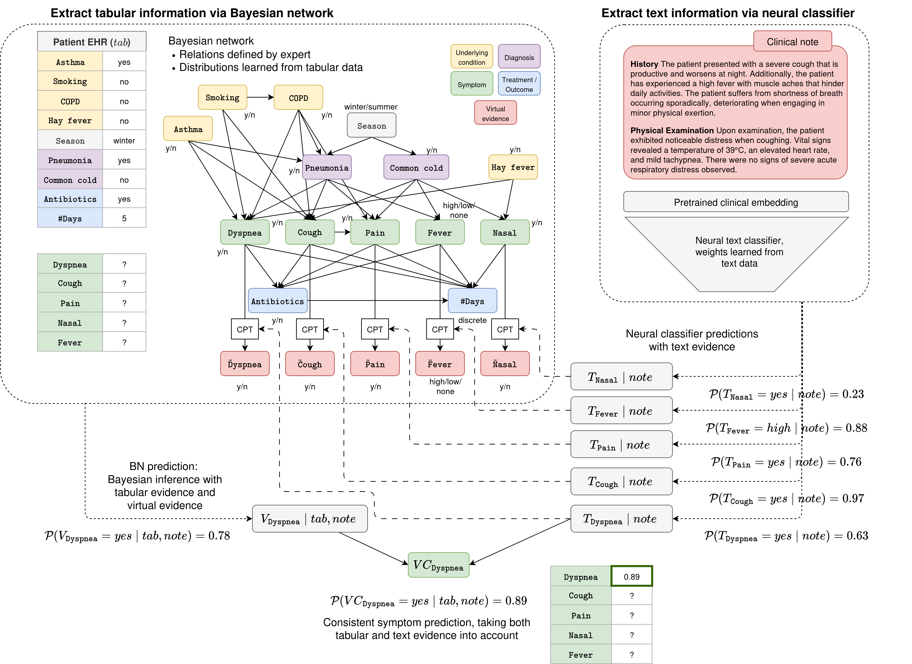

# Patient-level Information Extraction by Consistent Integration of Textual and Tabular Evidence

Paper will be released soon. (Make repository public when paper on Arxiv!)

## Overview

We propose a method for multi-modal patient-level information extraction that leverages both the tabular structured features already available in the patient's EHR -- which we model with an expert-informed Bayesian network -- as well as clinical notes describing the patient's symptoms -- from which we extract concepts using a neural classifier. We propose the use of virtual evidence and a consistency node to combine the predictions from both models in a probabilistic way. The figure below shows an overview of our method. 

In this figure, we show how to extract the probability that a patient suffers from the symptom dyspnea, given tabular evidence that is already encoded in the EHR and a clinical note describing the patient’s symptoms. On the right, the **neural classifiers** infer probabilities that the **text** mentions each symptom, with a 63\% confidence for $\texttt{Dyspnea}$ (since ''dyspnea'' is not mentioned verbatim). The classifiers' probabilities for each symptom are provided as **virtual evidence** to the **BN** - note the red "virtual" nodes in the network. On the left, the **BN** infers that the patient has a 78\% chance of $\texttt{Dyspnea}$, given all **tabular evidence** and **virtual evidence** (since the patient has both $\texttt{Pneumonia}$ and $\texttt{Asthma}$, this probability is high).  The consistency node $VC_{\texttt{Dyspnea}}$ combines these probabilities, arriving at an 89\% chance that this patient has $\texttt{Dyspnea}$.

We base our experiments on the [SimSUM dataset](https://github.com/prabaey/SimSUM). 

## Files

`utils` folder: 
- `bayesian_network.py`: Learn a Bayesian network from the tabular data. The causal relations between the variables are fixed, while the parameters of all conditional probability distributions in the Bayesian network are learned from a set of tabular training data. The trained Bayesian network can predict a symptom given the other tabular variables using Bayesian inference. Also implements virtual evidence. Adapted from [SimSUM](https://github.com/prabaey/SimSUM/blob/main/utils/bayesian_network.py).
- `neural_classifier.py`: Train a neural classifier to predict a symptom from a text note. We implement the classifier as a simple feed-forward neural network with two layers.  Adapted from [SimSUM](https://github.com/prabaey/SimSUM/blob/main/utils/neural_classifier.py).
- `consistency_node.py`: Combine the predictions of the trained Bayesian network over the tabular portion of the data and the trained neural text classifier over the textual portion of the data using a consistency node.

`simsum` folder: 
- `simsum/simsum_data_shift_mentions_1.p`: 5000 samples, file 1 of 2.
- `simsum/simsum_data_shift_mentions_2.p`: 5000 samples, file 2 of 2. The full 10000 samples are later split into training sets of <=8000 and a test set of 2000. Data was imported from [SimSUM](https://github.com/prabaey/SimSUM/tree/main/data/emb). We added a new columns containing manipulated versions of the normal notes where some symptom mentions were redacted (column name ``redacted``, with embeddings in column ``redacted_embeddings``). These were used in our data shift experiment. We also added new columns identifying if a given symptom is mentioned in the text of a clinical note (``dysp_mentioned``, ``cough_mentioned``, ``pain_mentioned``, ``nasal_mentioned``, and ``fever_mentioned``). Nothing about the original dataset was changed other than these added columns.
- `normal_span_annotations.json`: Span annotations for specific phrases in which each symptom is mentioned in the text notes. Imported from [SimSUM](https://github.com/prabaey/SimSUM/tree/main/data/emb).

`results` folder: Contains results for all our experiments. The output probabilities for all experiments are stored in `results/ie_text_tab_probabilities.p`. See the notebook `analyze_results.ipynb` for how we analyze the raw probabilities and the script `generate_latex_tables.py` for how we create the corresponding latex tables. 

main files: 
- `run_experiments.py`: Code to run experiments.
- `analyze_results.ipynb`: We show how to split the results into the appropriate experiments and generate the reported metrics.
- `data_shift_experiment.ipynb`: Explains the data shift experiment, where we make a new version of the text data with redacted symptom phrases. 
- `generate_latex_tables.py`: A script to generate the latex tables used in the paper from the metrics saved by `analyze_results.ipynb`.
- `requirements.txt`: lists the required Python packages & version numbers (if applicable). Install with ``pip install -r requirements.txt``
